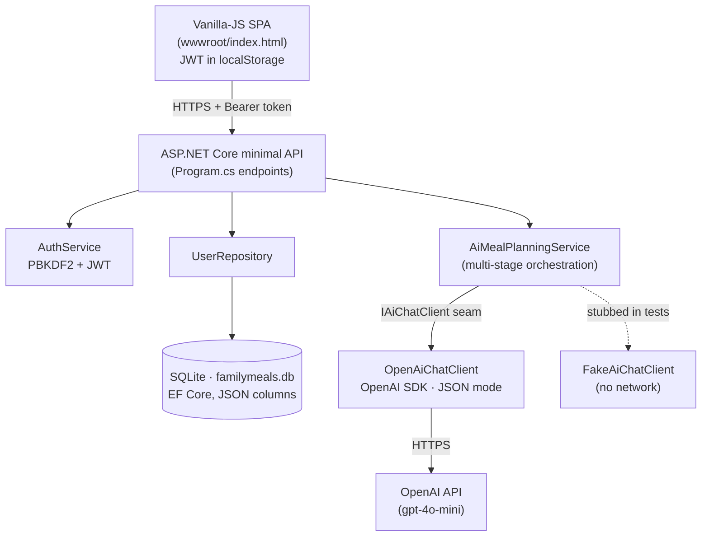
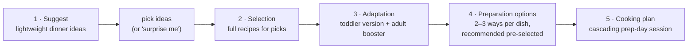
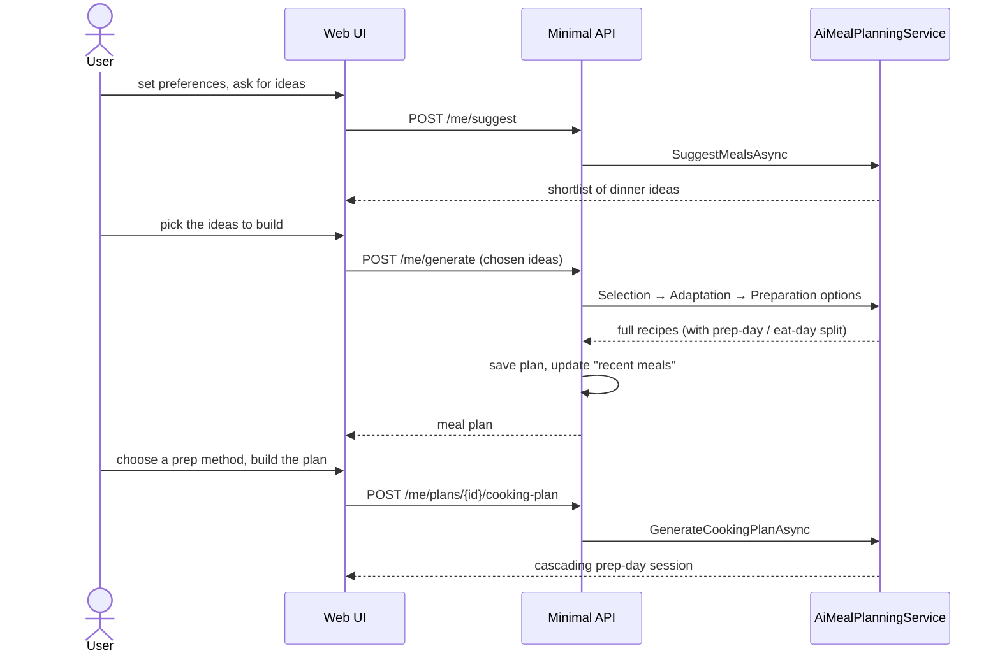

# Family Meal Architect: AI Meal-Prep Planner

A family meal-planning application demonstrating a **multi-stage AI pipeline** over the
**OpenAI** SDK, built on a **.NET 9 minimal API** with **EF Core + SQLite** persistence and
**JWT** auth. One idea drives the whole design: **prep once, eat well all week.**

A big prep-day session does the heavy lifting, so each busy weekday needs only a short,
hands-on finish: a configurable 10–15 minutes of *active* cooking (passive oven / simmer
time doesn't count).

> Started as a private experiment to learn multi-stage AI reasoning, prompt engineering, and
> cost-aware AI usage. It has grown into a working full-stack app with accounts, persistence,
> an interactive planning flow, and an automated test suite.

## 🏗️ Architecture Overview

A single .NET 9 minimal API hosts everything: the AI orchestration, the persistence layer, and
the static web UI. Recipes are produced by a **multi-stage AI pipeline** (each stage is a
separate, JSON-mode OpenAI call with a typed DTO) rather than one monolithic prompt. A testable
`IAiChatClient` seam sits in front of OpenAI so the whole pipeline runs offline in tests.



### The multi-stage AI pipeline

Instead of asking the model for "3 recipes" in one shot, generation is broken into focused stages.
Each stage gets a narrow prompt and returns structured JSON, which keeps every step reliable,
individually testable, and separately costed (input/output tokens are tracked per stage).



> The adaptation stage is gated by the `OpenAI:MultiStage` flag; turn it off to run a leaner
> Selection-only pipeline.

### The interactive planning flow



## 🚀 Getting Started

### Prerequisites

- .NET 9 SDK
- An OpenAI API key
- IDE (Visual Studio 2022, Rider, or VS Code), optional

### Running the Application

```bash
# from the repo root
# bash:        export OpenAI__ApiKey="sk-..."
# PowerShell:  $env:OpenAI__ApiKey = "sk-..."

dotnet run --project src/FamilyMealArchitect/Api
```

Then open **http://localhost:5234/**.

> The API key is read from configuration key `OpenAI:ApiKey`: set it via the `OpenAI__ApiKey`
> environment variable or .NET user-secrets. **Never commit it.** In development a JWT signing
> key is auto-generated if `Jwt__Key` isn't set (tokens then reset on restart); set `Jwt__Key`
> for a stable key.

### First Steps

1. **Register** an account and **log in**.
2. Set your **preferences**: family size, dietary notes, equipment, and the weekday
   active-cooking limit.
3. Ask for **ideas**, pick the dinners you like (or hit *surprise me*), and **build** them.
4. Choose a **preparation method** per dish and generate the **prep-day cooking plan**.
5. Generate a **shopping list**, swap any single meal, or browse past plans in **history**.

### Running the Tests

```bash
dotnet test src/FamilyMealArchitect/Tests/Tests.csproj
```

Tests stub the AI client (`FakeAiChatClient`) and use in-memory SQLite, so they make **no network
calls** and need no API key.

## 📂 Project Structure

```
ai-meal-planning-experiment/
├── src/FamilyMealArchitect/
│   ├── Api/                         # .NET 9 minimal API
│   │   ├── Program.cs               # DI, auth, endpoints
│   │   ├── Data/                    # AppDbContext + UserRepository (EF Core/SQLite)
│   │   ├── Models/                  # entities + AI JSON DTOs
│   │   ├── Services/                # AiMealPlanningService, AuthService, IAiChatClient
│   │   ├── wwwroot/index.html       # web UI
│   │   ├── Api.http                 # ready-to-run example requests
│   │   └── App_Data/                # SQLite db (gitignored)
│   └── Tests/                       # xUnit tests (stubbed AI client)
├── cooking/ , household/            # personal recipe / tip notes
└── README.md
```

## 🍳 Prep-Day / Eat-Day Recipes

Every recipe separates the make-ahead work from the weekday finish:

- **Prep day** does the heavy lifting (chop, marinate, par-cook, sauces, assembly) and ends by
  portioning and storing each component.
- **Eat day** is a short, hands-on finish (sear, bake, reheat) bounded by an **active-minutes
  budget** you control. Passive oven/simmer time doesn't count against it.
- Each recipe carries a **toddler version** and an **adult booster** so one cook serves the whole
  family, plus **ingredients with quantities**, **servings**, and **storage instructions**.

## 🛒 Shopping Lists & Per-Meal Tweaks

- A consolidated **shopping list** is generated from the recipes' real ingredient quantities.
- **Swap any single meal** without regenerating the rest of the plan.
- **Change a dish's preparation method** and rebuild the cascading prep-day plan around the new
  selection.

## 👤 Accounts & History

Register / log in to save your **family profile** and browse **past plans**. Generated meals are
auto-added to a per-user **"recent meals to avoid"** list (deduped, newest-first, capped) so plans
stay varied week to week.

## ⚙️ Configuration

Set via `appsettings.json` or environment variables (double-underscore form, e.g. `OpenAI__ApiKey`).

| Key | Purpose | Default |
| --- | --- | --- |
| `OpenAI:ApiKey` | OpenAI API key (use env / secrets) | none (required) |
| `OpenAI:ModelName` | Chat model | `gpt-4o-mini` |
| `OpenAI:MultiStage` | Run the full multi-stage pipeline | `true` |
| `OpenAI:InputCostPer1MTokens` / `OutputCostPer1MTokens` | Cost estimation rates (USD / 1M) | `0.15` / `0.60` |
| `Jwt:Key` | JWT signing key | auto-generated in dev; **required** otherwise |
| `Jwt:Issuer` / `Jwt:Audience` / `Jwt:ExpiryMinutes` | JWT settings | `FamilyMealArchitect` / same / 7 days |

## 🔌 API Overview

**Public:** `GET /health`.

**Auth:** `POST /auth/register`, `POST /auth/login`.

**Authenticated utilities:** `GET /test-ai` (connectivity check), `POST /generate` (ad-hoc plan,
nothing saved). Every endpoint that calls OpenAI requires a JWT and is **rate-limited**
(10 requests/minute per user) so the API key can't be drained.

**Current user** (JWT required):

| Endpoint | Purpose |
| --- | --- |
| `GET /me`, `PUT /me` | Profile & preferences |
| `POST /me/suggest` | Lightweight dinner ideas |
| `POST /me/generate` | Build full recipes (optionally for chosen ideas), saved to history |
| `GET /me/plans`, `GET /me/plans/{id}`, `DELETE /me/plans/{id}` | List / read / delete plans |
| `POST /me/plans/{id}/shopping-list` | Generate a shopping list |
| `POST /me/plans/{id}/meals/{index}/regenerate` | Swap one meal |
| `POST /me/plans/{id}/cooking-plan` | Apply preparation choices and rebuild the prep-day plan |

See [`src/FamilyMealArchitect/Api/Api.http`](src/FamilyMealArchitect/Api/Api.http) for ready-to-run
example requests.

## 🎯 Key Design Decisions

### Why a multi-stage pipeline (not one big prompt)?

- **Reliability:** each stage has a narrow job and returns a small, typed JSON payload, so the
  model is far less likely to drift or produce malformed output than with one giant prompt.
- **Interactivity:** splitting *suggest* from *build* lets the user steer before any expensive
  recipe generation happens.
- **Cost visibility:** input/output tokens are tracked per stage, so the cost of a plan is
  attributable and the `MultiStage` flag can trade depth for spend.

### Why an `IAiChatClient` seam?

The orchestration depends on an interface, not the OpenAI SDK directly. Production wires up
`OpenAiChatClient`; tests wire up `FakeAiChatClient` with queued responses. The entire pipeline is
therefore **unit-tested with zero network calls and no API key**.

### Why EF Core + SQLite with JSON columns?

A meal plan is a rich object graph (meals → preparation methods, ingredients, phases). Storing
those as **JSON-backed columns** keeps the schema simple while preserving the full structure. A
custom deep **value comparer** makes EF Core's change tracking detect in-place edits to those
graphs correctly.

### Why minimal API?

One self-contained host for endpoints, DI, auth, and static files keeps a learning-sized project
easy to read end-to-end, with no controller/boilerplate layering to wade through.

## 🛠️ Technologies

- **.NET 9** - minimal API, modern C#
- **OpenAI SDK** - `gpt-4o-mini` by default, JSON response mode for reliable parsing
- **EF Core 9 + SQLite** - persistence with JSON value converters and deep value comparers
- **JWT bearer auth** - with PBKDF2 password hashing
- **Vanilla JS** - single-page UI served from `wwwroot/`
- **xUnit** - test project with a stubbed AI client and in-memory SQLite

## 📝 Development Notes

- The web UI is a single static `index.html`; the API serves it and the SPA holds the JWT in
  `localStorage`.
- `App_Data/` (the SQLite database) is gitignored; it holds personal data and is created on first
  run via `EnsureCreated()`.
- Use `Api.http` (VS Code / Rider REST client) to exercise the endpoints without the UI.

---

## License

MIT. See [LICENSE](LICENSE).

---

**Built with ❤️ as a multi-stage AI learning project**
